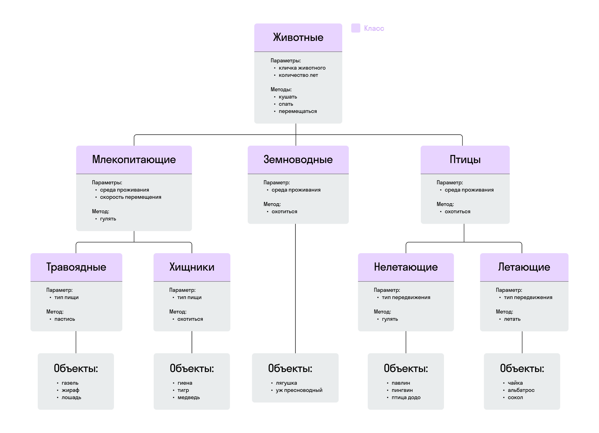

### Задание 1

Напишите программу, в которой реализована иерархия классов на схеме ниже

На что важно обращать внимание при выполнении задания:

- Методы eat и go должны быть переопределены в классах-наследниках
- Класс травоядные наследует параметры и методы классов-родителей млекопитающие и животные.
- При создании классов не забывайте о модификаторах доступа
- Для параметров не забывайте создавать геттеры и сеттеры. Какие параметры можно менять,
а какие нельзя – пропишите самостоятельно, исходя из логики приложения
- Для каждого параметра должна быть реализована поверка вводимых данных:
    - корректное значение
    - параметр не пустой
    - параметр не равен null
- С помощью метода equals должна быть реализована проверка, что все объекты уникальны в рамках каждого класса.
Например, всё объекты класса травоядные уникальные, и в зоопарке нет двух жирафов
- Выведите в консоль по каждому объекту информацию по всем присущим объекту параметрам,
а также информацию о том, к какому классу принадлежит объект.
- Подсказка

  Вывести информацию о строковом представлении объекта можно с помощью метода toString ().

- Критерии оценки
    - Создан класс животные набором параметров и методов
    - Класс млекопитающие наследуется от класса животные
    - Класс травоядные наследуется от класса млекопитающие
    - Класс хищники наследуется от класса млекопитающие
    - Класс земноводные наследуется от класса животные
    - Класс птицы наследуется от класса животные
    - Класс летающие наследуется от класса птицы
    - Класс нелетающие наследуется от класса птицы
    - Метод кушать переопределен
    - Метод перемещаться переопределен
    - Настроены модификаторы доступа
    - Созданы геттеры и сеттеры
    - Настроены проверки данных
    - Созданы объекты для классов